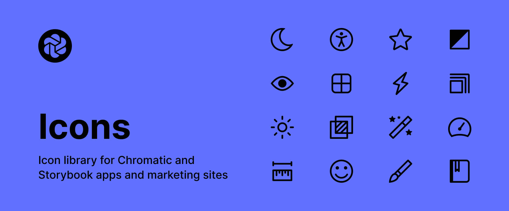

# Icons



This library contains the icons used in Chromatic UI and marketing site.

## Install

```console
yarn add @chromaui/tetra
```

## To Do

- [ ] Export every single icons instead of a single component
- [ ] Import coloured icons

## Developing

Watch and rebuild code with `tsup` and runs Storybook to preview your UI during development.

```console
yarn storybook
```

## Building

Build package with `tsup` for production.

```console
yarn build
```
